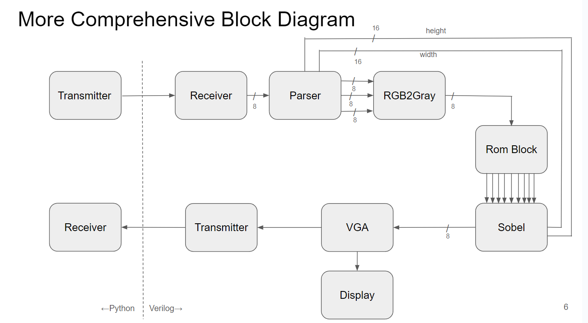

# EC551 Final Project: edge detector

### Team member: Xiteng Yao, Hamed Rastaghi, Thomas Kelly, Shining Yang

## Introduction

This project uses an ARTIX-7 FPGA with Verilog and Vivado for image edge detection. In our design data is transmited from PC to FPGA using UART and the edge detection result is displayed on a monitor. Key modules include uart_receiver for data transmission, rgb2gray for conversion, ROM_BLOCK for memory Management, Sobel for the algorithm, and VGA for display. There're also several Python file used for setting up UART data transmission and image preprocessing.

The image below shows an overview of the project.

## Progress after presentation (Dec. 5th, 2023)
1. Improved testbench to include all the modules we developed  -  Success
2. Tested the VGA module on board   -  Success
3. Tested the improved UART IO modules on board  -  Success
4. Tested the entire pipeline on board   -  Success

## Demo Video Link
https://drive.google.com/file/d/1uV7F1Ja0sd-VJVAe7VBD715uClMVlNRo/view?usp=drive_link

## Files and Contribution of Work

All files that are used in the end are in the final_product folder. Other files we developed are inside the legacy_codes folder. Below are some brief explanation of the files.

### Verilog Files
1. sobel_v3.v 
   1. This is the file that process the image and run the sobel algorithm
   2. Author: Hamed
2. BLOCK_ROM.v
   1. This module utilize a memory management IP core to instantiate a memory block. The memory is used to store data before and after processing
   2. Author: Hamed
3. parse_v3.v rgb2gray.v
   1. These 2 files extracts important information like dimensions from the files, and transforn the rgb data into grayscale data for later process
   2. Author: Thomas
4. uart_receiver uart_transmitter
   1. These two modules are used for image transmission between the FPGA and PC via UART
   2. Author: Xitenng
5. new_top_v3.v
   1. The top module that connects every modules together
   2. Author: Xiteng, assisted by Thomas, Hamed
6. VGA.v
   1. The module for image display
   2. Author: Shining

### Python files

1. coe_converter.py
   1. Connverts an image to coe format so a BRAM can read it.
   2. Author: Thomas
2. preprocess.py
   1. Generate byte files from iamge, the byte files are used as input for later modules.
   2. Author: Xiteng
5. reconstruct.py
   1. A program that rebuilds image from byte file received.
   2. Author: Xiteng
8. reference.py
   1. A program that uses opencv to do the same sobel edge detection. Used to compare performance and verifying correctness.
   2. Author: Xiteng

   

## User Guide
### How to generate input data for the testbenches and on board testing?
1. First, open the "images_and_preprocessing" folder.
2. Move the file you want to the same folder as "preprocess.py".
2. Use "python preprocess.py" to convert an image to a file containing the bytes, make sure to change the filenames.
3. The program outputs 2 files, one is for grayscale, one is for rgb. They are used in different scenarios.
4. For testbenches and on-board testing, use the rgb version. The first 4 bytes of the rgb version are the dimension bytes.
5. If you got a processed image from the testbenches, you can use "reconstruct.py" to rebuild the image from the bytes file, keep in mind that the bytes may vary and needs to be checkd before use.

### How to run testbenches?
1. The testbenches are located at "legacy_codes\testbenches", there are three testbenches in total.
   1. 1 is for testing the UART receiver and transmitter.
   2. 2 is for testing the grayscale sobel edge detection, grayscale byte file is needed as input.
   3. 3 is for testing the RGB sobel edge detection, which is the most comprehensive testbench, rgb byte file is needed as input.
2. To run the sim_3 testbench, you need to first generate the input file using the steps in "How to generate input data for the testbenches and on board testing?".
3. Then, place the input file in the working directory of the testbench.
4. The received data will be saved as "received_data.hex" in the working directory of the testbench.
5. The received data can be used to reconstruct the image using "reconstruct.py" in "images_and_preprocessing" folder.

### How to do on board testing?
1. Configure the verilog codes correctly before start
   1. codes are in "final_product" folder
   2. The top module is called "new_top_v3.v" make sure to configure the IO correctly with the given constraint
   3. Set a baud rate for testing, and adjust the BAUD_VAL in the top module. BAUD_VAL = FPGA_clock_frequency/baud_rate
   3. Configure the IP core using the given BRAM code
   3. Go through the steps of Vivado, including synthesis, implementation, and generate bitstream
   4. Program the FPGA with the bitstream file
2. Follow the steps in "How to generate input data for the testbenches and on board testing?" to generate the input file
   1. Place the generated file in the same folder as the python script, "UART_IO.py"
   2. In UART_IO.py, remember to check the port number and baud rate to match the setting of FPGA and Verilog code
   3. Also, set the file size to the size of file that you expect the FPGA to send back. If this is too large, runtime will be very long
   3. Run the UART_IO.py to transmit the file to the FPGA
   4. The same script shall also be able to receive data from fpga
   5. If successful, the received data will be saved as "fpga_image.hex" in the same folder as the python script
   6. This can be used to reconstruct the image using "reconstruct.py" in "images_and_preprocessing" folder

## References

1. https://github.com/ibrahimayaz95/UART/tree/main
2. https://www.edaboard.com/threads/verilog-testbench-for-an-image-processing-task.215509/
3. https://narendiran1996.github.io/project-blogs/jekyll/update/2021/07/21/uart-fpga-vga.html
3. https://www.youtube.com/watch?v=LHfm91SThqI
4. https://www.youtube.com/watch?v=9f4i1Fq7xak
5. https://docs.xilinx.com/r/en-US/ug908-vivado-programming-debugging/Using-Vivado-Serial-I/O-Analyzer-to-Debug-the-Design
6. https://www.putty.org/
7. https://stackoverflow.com/questions/22351254/python-script-to-convert-image-into-byte-array
8. https://stackoverflow.com/questions/33101935/convert-pil-image-to-byte-array
9. https://forum.allaboutcircuits.com/threads/can-data-be-transferred-and-received-at-the-same-time-through-uart.191047/
10. https://stackoverflow.com/questions/48183066/pyserial-send-and-receive
11. https://stackoverflow.com/questions/56010307/how-to-send-and-receive-data-from-python-to-arduino-at-the-same-time
12. https://stackoverflow.com/questions/57543929/receive-data-via-uart-with-python
13. https://forums.raspberrypi.com/viewtopic.php?t=226058
14. https://pyserial.readthedocs.io/en/latest/pyserial_api.html
15. https://support.xilinx.com/s/question/0D52E00006iHqQuSAK/synthesis-problem-when-resetting-a-large-array-of-registers?language=en_US
16. https://support.xilinx.com/s/question/0D52E00006hpZuYSAU/error-synth-84556-size-of-variable-is-too-large-to-handle-?language=en_US